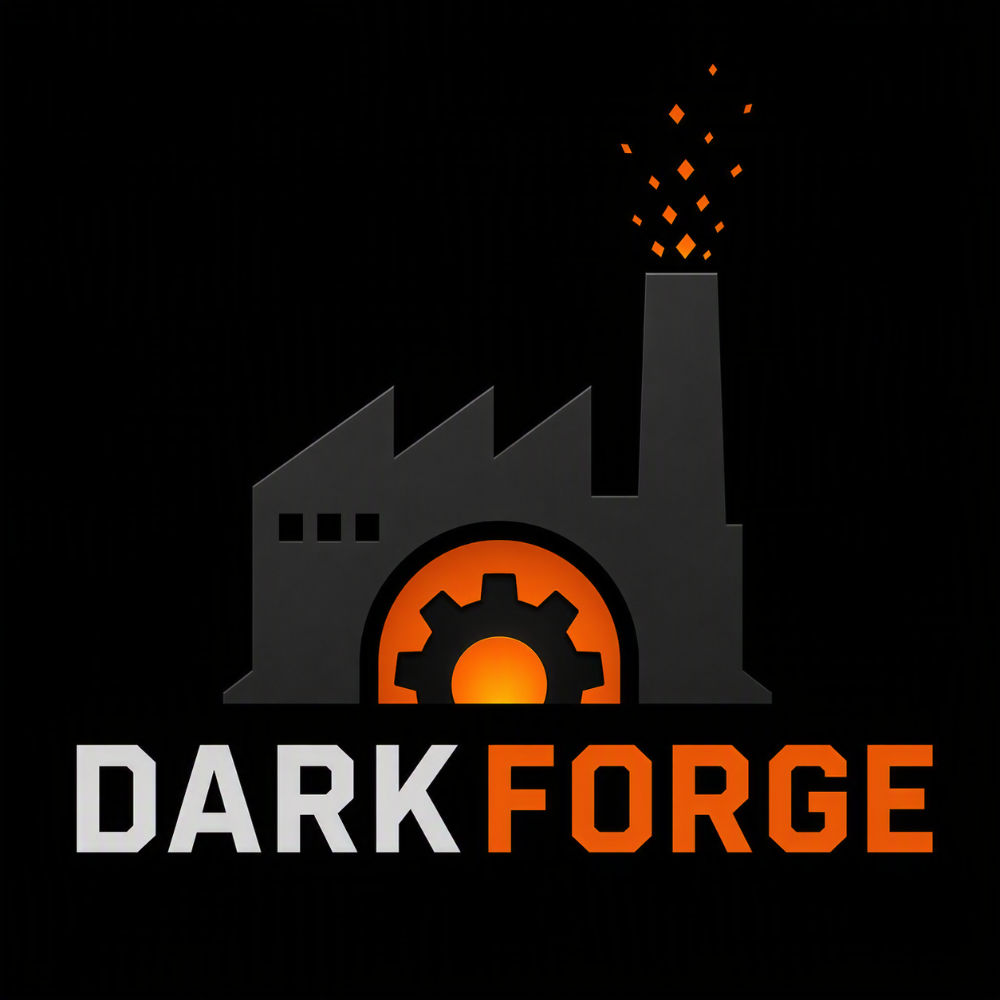

<p align="center">
  
</p>

# DarkForge

**The execution substrate for distributed AI engineering on Azure. One engineer, a fleet of
safely-parallel sandboxes, 100× the work.**

A working Azure deployment of a Kubernetes-native, Kata-isolated sandbox runtime where
engineers and their agents run code they want to be able to throw away. The stack is wired
end-to-end: any LLM agent or developer SDK can call `Sandbox.create`, get back a running
Kata-isolated pod, execute code, and read results. Kimi K2.5 in Microsoft Foundry is one
worked example; the path generalises to GPT, Claude, or any other model the platform team
chooses to wire in.

Everything in this repo describes the Azure landing zone — the AKS cluster, Kata node pool,
ACR Premium with private endpoint, Azure Firewall egress, Event Hubs/Stream Analytics audit
pipeline, Workload Identity, ACA control plane, and the deployment IaC.

## Why this exists — motivation & philosophy

The bottleneck for distributed AI engineering at most enterprises is not the model. It's
the **execution substrate** the agents run against. An AI agent that cannot reliably and
safely execute its own generated code, in parallel, with the same identity and audit story
as a human engineer, is a chatbot — not a teammate.

The project's premise is one sentence:

> **An engineer with a fleet of safely-parallel sandboxes can do 100× more distributed
> AI engineering than the same engineer typing into a single shell.**

To make that real inside an enterprise, four properties have to hold simultaneously, and
they're hard to get *together* — which is the gap this repo fills:

1. **Hard isolation, because blast radius is the bottleneck.** Engineers run code they want
   to throw away — LLM-generated, half-baked, disposable, dozens of variants at once. On a
   shared-kernel container, one bad `pip install` or `rm -rf` poisons the AKS node and
   everyone else's work on it. The trust boundary here is **Kata Containers** — per-pod
   VM-grade isolation with its own guest kernel, not a Linux namespace. A misbehaving agent
   (or, in the rare case, a hostile one) earns an empty disposable VM and nothing else.

2. **Per-user identity, end to end.** Every sandbox action traces to a real Entra ID
   identity via OBO → Workload Identity → projected SA token. No shared service-principal
   "platform" account erasing the user in audit logs. An agent acting on behalf of an
   engineer leaves the engineer's name on every API call, every egress flow, every secret
   fetch.

3. **Deny-by-default at every layer.** Azure Policy in Deny mode, Cilium L7 FQDN
   allowlist on egress, Azure Firewall Premium as the network backstop, Kubernetes RBAC
   bound to Entra groups, ACR public access disabled with a private endpoint, signed
   images at admission. Anything not explicitly permitted is dropped — and the audit
   pipeline sees it drop.

4. **Reproducible IaC.** Bicep for the landing zone, Helm for the runtime. The whole
   thing should rebuild from a fresh subscription with `az deployment sub create` plus a
   Helm install — no clicks, no tribal knowledge.

### The 100× thesis

A single engineer driving a fleet of these sandboxes can:

- **Parallelise grunt work** — run hundreds of small evaluations, dependency
  upgrades, security scans, doc generations, or migrations concurrently, each in its own
  Kata pod, each attributed to the engineer, each isolated from the others.
- **Let agents iterate safely** — give a Kimi-K2.5 / GPT / Claude agent a sandbox it
  can write to, break, and discard, without ever touching the engineer's laptop or the
  shared infra. The agent's blast radius is the inside of one VM.
- **Treat code execution as a cloud primitive** — `Sandbox.create()` is as cheap to
  call as `BlobClient.upload()`. Once the substrate is solid, the engineer stops
  thinking about *where* code runs and starts thinking about *what* runs.
- **Keep the auditor happy** — every command, every egress destination, every secret
  read flows into Event Hubs → Stream Analytics → Log Analytics inside ≤60 s, attributed
  to a real user OID. There is no "AI used my creds and we don't know what it did"
  failure mode.

This is the substrate. The agents, the evaluation harnesses, the migration scripts —
those are what you build *on top* of it. The repo is the thing nobody wants to build
twice.

## What's actually running right now

Resource groups `rg-opensandbox-dev` (cluster + control plane) and `rg-opensandbox-demo` (ACR),
both in `eastus2`.

| Layer | Resource | Notes |
|---|---|---|
| Cluster | `aks-opensandbox-dev` | Kubernetes 1.34.7, Azure CNI Overlay + Cilium dataplane, ACNS + Hubble UI |
| System pool | 3 nodes (runc) | Sandbox controller, server, ingress, system addons |
| Kata pool | Kata Containers, `kata-vm-isolation` runtime class | Cloud Hypervisor (MSHV), inner-VM kernel `6.6.130.1-3.azl3` (Azure Linux 3) |
| Container registry | `acropensandboxdemo7075` (ACR Premium) | Public access disabled, private endpoint `pe-acr-opensandbox-dev` (10.10.12.6), private DNS zone `privatelink.azurecr.io` |
| Egress firewall | `afw-opensandbox-dev` (Azure Firewall Premium) | Private IP 10.10.10.4, policy `afwp-opensandbox-dev`, two rule collection groups (`rcg-aks-bootstrap` p100, `rcg-sandbox-egress` p200), deny-all at p300 |
| Sandbox UDR | `rt-snet-kata-dev` | Forces 0.0.0.0/0 from `snet-kata` to the firewall |
| Audit pipeline | Event Hubs `evhns-opensandbox-dev` (LocalAuthDisabled) → Stream Analytics `asa-opensandbox-audit-dev` → blob `stasadevse3bwihj3in4s/audit-fast` | Event hub `sandbox-audit-fast`, 4 partitions; ASA uses system-assigned MI with EH Data Receiver + Storage Blob Data Contributor |
| Control plane (ACA) | `acaenv-opensandbox-dev` in snet-aca | 3 container apps |
| Foundry | `aihubeastus26267492086` | Kimi-K2.5 + Kimi-K2.6 deployments |
| Workload identity | `id-kimi-demo-dev` | Federated to the `demo` namespace's service account |
| Key Vault | `kv-opensandbox-dev` | Private endpoint `pe-kv-opensandbox-dev` |

## Architecture at a glance

Two call paths, both bottoming out in the same controller + Kata sandbox pod.

```
Path A — Laptop SDK (sdk_e2e.py)
================================

   developer laptop                       AKS cluster (aks-opensandbox-dev)
  +-----------------+                +------------------------------------------+
  |                 |                |                                          |
  |  Sandbox.create | --HTTP-->      |  sandbox server (FastAPI)                |
  |  Python SDK     |  kubectl       |     |                                    |
  |                 |  port-forward  |     v  creates BatchSandbox CR           |
  |  api-key auth   |  :18080        |  sandbox controller-manager (Go)         |
  +-----------------+                |     |                                    |
                                     |     v  schedules pod onto Kata pool      |
                                     |  +----------------------------------+   |
                                     |  | Sandbox pod                      |   |
                                     |  |   runtimeClassName:              |   |
                                     |  |   kata-vm-isolation              |   |
                                     |  |                                  |   |
                                     |  |   init: execd (v1.0.8, CRLF-fixed|   |
                                     |  |   sidecar: execd daemon         )|   |
                                     |  |   user container: python:3.12   )|   |
                                     |  +----------------------------------+   |
                                     +------------------------------------------+
                                                       |
                                                       v   egress via UDR
                                                  Azure Firewall (allowlist)
                                                       |
                                                       v
                                                 pypi / npm / proxy.golang.org


Path B — Kimi agentic app (kimi_via_osb.py)
============================================

  Kimi-K2.5 / K2.6  ----(AAD bearer)----> Microsoft Foundry (aihubeastus...)
       ^                                       |
       | code in <code>...</code>              | generated Python
       |                                       v
  +----+-------------------------------------------------------------+
  | kimi_via_osb.py — extracts code, hands to the sandbox SDK         |
  +------------------------------------------------------------------+
                                       |
                                       v   (same path as A from here)
                              sandbox server -> controller -> Kata pod
                                       |
                                       v
                              python3 /tmp/kimi_code.py inside the sandbox
                                       |
                                       v
                                    result returned to the agent
```

A deeper diagram with all eleven components, the VNet/subnet table, identity flow, and the egress
data path lives in [docs/ARCHITECTURE.md](docs/ARCHITECTURE.md).

## Quickstart — reproduce the two demos

These steps assume an operator with cluster-admin (or equivalent kubelogin) access to
`aks-opensandbox-dev` and a Python 3.11+ environment.

```bash
# 0. Auth + cluster context
az login
az aks get-credentials -g rg-opensandbox-dev -n aks-opensandbox-dev --overwrite-existing

# 1. Install the sandbox Python SDK
pip install opensandbox

# 2. Port-forward the sandbox server to localhost:18080
kubectl -n opensandbox-system port-forward svc/opensandbox-server 18080:8080 &

# 3. Drop the server API key into examples/ for the demo scripts to read
kubectl -n opensandbox-system get secret opensandbox-server -o jsonpath='{.data.OPENSANDBOX_SERVER_API_KEY}' \
  | base64 -d > examples/.opensandbox-api-key

# 4a. Run the laptop SDK demo
python examples/sdk_e2e.py

# 4b. Run the Kimi agentic demo
#     (requires az login with access to aihubeastus26267492086)
python examples/kimi_via_osb.py
```

## Repository layout

| Path | Purpose |
|---|---|
| [`third_party/opensandbox/`](third_party/opensandbox/) | Third-party sandbox runtime, vendored. Do not edit; sync via the upstream-sync workflow. |
| [`infra/bicep/`](infra/bicep/) | Subscription-scope Bicep for the Azure landing zone (cluster, ACR, firewall, audit). |
| [`infra/helm/opensandbox/`](infra/helm/opensandbox/) | Helm chart deploying the sandbox runtime images (controller, server, execd) with Azure-specific values. |
| [`apps/`](apps/) | Control-plane services on ACA. `apps/control-plane/` is implemented (FastAPI). `apps/portal-api/` and `apps/portal-frontend/` are scaffolds — ACA revisions provisioned, no source yet. See [ROADMAP.md](ROADMAP.md) and OSEP-0006 (`third_party/opensandbox/oseps/0006-developer-console.md`). |
| [`sdks/`](sdks/) | Azure-flavored SDK wrappers and examples. |
| [`examples/`](examples/) | Runnable demos: laptop SDK, Kimi agentic app, hypothesis swarm. See [`docs/DEMO-HYPOTHESIS-SWARM.md`](docs/DEMO-HYPOTHESIS-SWARM.md). |
| [`docs/`](docs/) | This documentation set. |
| [`runbooks/`](runbooks/) | Ops runbooks: incident response, onboarding, CVE response, DR drill. |

## Documentation

- [docs/ARCHITECTURE.md](docs/ARCHITECTURE.md) — full architecture deep-dive, VNet table,
  identity and egress flows, image supply chain, failure modes, the CRLF bootstrap story.
- [docs/OPERATIONS.md](docs/OPERATIONS.md) — runbook index, cluster health checklist, image
  onboarding, API key rotation, execd rebuild and roll-out.
- [docs/index.md](docs/index.md) — entry point linking to everything above.
- [docs/acceptance-checklist.md](docs/acceptance-checklist.md) — the 34 acceptance criteria for v1.
- [ROADMAP.md](ROADMAP.md) — what is done, what is deferred, what is next.

## Patches against the vendored runtime

There are exactly two delta points against `third_party/opensandbox/`:

1. `goproxy.cn` → `proxy.golang.org` in the build for Azure-region pulls.
2. CRLF protection in `bootstrap.sh` (the script must be LF-only or `execd` init crashes the
   sandbox before the daemon attaches). Enforced by `.gitattributes`. See
   [docs/ARCHITECTURE.md#the-crlf-bootstrap-story](docs/ARCHITECTURE.md#the-crlf-bootstrap-story).

## Acknowledgement and licenses

DarkForge — the Azure landing zone, IaC, docs, and SDK wrappers under this repo — is
licensed under the MIT [`LICENSE`](LICENSE).

The sandbox runtime under [`third_party/opensandbox/`](third_party/opensandbox/) is the
upstream [alibaba/OpenSandbox](https://github.com/alibaba/OpenSandbox) project (Apache
License 2.0, © Alibaba Group and contributors). It is vendored unmodified except for the
two patches listed above, both of which are documented in
[`THIRD_PARTY_LICENSES.md`](THIRD_PARTY_LICENSES.md) as required by Apache-2.0 §4(b).
The upstream LICENSE is preserved at
[`third_party/opensandbox/LICENSE`](third_party/opensandbox/LICENSE) and applies to all
files in that directory. See also [`NOTICE`](NOTICE).
